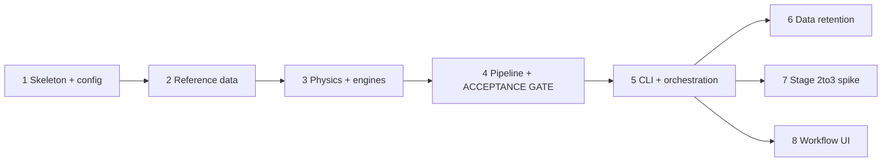

# Phase 00 — v1 Roadmap

**Date:** 2026-06-29 15:35
**Phase:** 0 (orientation & roadmap; no code)
**Inputs read:** `.agent/handoff/` README + 01–05, `proposed_skeleton/` (README, `config.py`/`cli.py`/`engines/base.py` stubs, `tests/test_acceptance.py`), v0 orientation files (`src_archive/METHODOLOGY.md`, `src_archive/config.yaml`, `src_archive/analysis_outputs/analysis_report.md`), and `.agent/local_memory/v1_build_prompts.md`. No archive data directories were loaded.

---

## Objective (restated)

Rebuild the **back half** of the tree thermal-safety pipeline — Stages 3–5 (Radiance
irradiance → coupled ground/leaf/soil biophysics → risk metrics & scenario ranking) — as a
clean, config-driven `treeheat` package with a **pluggable canopy engine**. This is a tight
reimplementation, **not a port** of the accreted `src_archive/` code. It inherits the proven
science (`METHODOLOGY.md`, the two databases, the validated result) and fixes the three
messes called out in `03_consolidation_recommendations.md`: five competing entry points,
hardcoded absolute paths, and ~12 one-off scaffolding scripts in the main namespace. Stages
1–2 (photogrammetry → Rhino/Grasshopper) stay out of scope until the back half reproduces
the paper.

## Acceptance gate (restated) — defines "v1 works"

From the same site inputs, v1 must reproduce the paper's headline numbers
(`analysis_report.md`, 25 scenarios × 147 trees, reference = `scenario_012` 50/50):

- Risk vs **albedo**: slope ≈ **+61 %/unit**, R² ≈ **0.87**
- Risk vs **emissivity**: slope ≈ **−194 %/unit**, R² ≈ **0.64**
- **Best** = `scenario_004` (100% natural landscape) ≈ **−5 %** vs 50/50
- **Worst** = `scenario_020` (100% hard facade) ≈ **+13 %**

No new science ships until this test passes (Phase 4).

---

## Key decisions agreed in this session

1. **Gate inputs = frozen feathers.** The acceptance gate reuses the existing v0
   `raytracing_results/*.feather` as **fixed test fixtures**, isolating the physics port from
   a Radiance re-run. A full end-to-end Radiance re-run (needs `pyradiance` + Accelerad +
   scene geometry, and stresses the fragile Stage 2→3 seam) is deferred — not part of the
   gate. *Rationale:* turns the gate into a physics-port problem, not an
   environment/geometry problem; fast and deterministic.
2. **v1 location = top-level `treeheat/`.** The clean v1 tree is a new top-level directory
   `thermal-sandbox/treeheat/`, with the v0 `*_archive/` folders untouched alongside. The
   `proposed_skeleton/` contents materialize there, giving the conventional
   `treeheat/treeheat/` package layout (project dir contains the package, `config/`, `data/`,
   `outputs/`, `tests/`, `pyproject.toml`).

---

## Build phases — dependencies and "done"

Sequencing per `03_consolidation_recommendations.md` and the drafted phase prompts in
`v1_build_prompts.md`.

- **Phase 1 — Skeleton + config.** *Deps:* none. Adopt/refine `proposed_skeleton/` as the
  v1 package at `treeheat/`; implement `config.py` (`defaults.yaml` overridden by
  `config.yaml`, relative paths resolved against the config dir) + `validate_config()` that
  fails loudly; packaging (`pyproject`) + minimal test harness.
  *Done:* `validate_config()` passes on a good config and errors clearly on a missing
  key/path; package imports cleanly; engine registry resolves.
- **Phase 2 — Reference data.** *Deps:* 1. Move the two databases + `METHODOLOGY.md` into
  `data/`/docs; typed loaders carrying schemas forward unchanged.
  *Done:* loaders return validated, typed records; a schema-conformance test guards the CSVs;
  `METHODOLOGY` referenced as authoritative, not duplicated.
- **Phase 3 — Physics behind the engine interface.** *Deps:* 1, 2. Finalize `CanopyEngine`
  from the **two real engines** (li2023_ceb + legacy_leaf); port
  `ground`/`surface`/`soil_moisture`/`upwelling`; wire the integrator to
  `engines.get_engine(config)` — it never imports a concrete model.
  *Done:* single-tree/single-hour CEB solve matches v0 for identical inputs; switching to
  legacy is a one-line config change.
- **Phase 4 — Radiance + risk + analysis + THE GATE.** *Deps:* 3. Port the DDS runner (kept
  available but not exercised by the gate), risk metrics, cross-scenario analysis, plots;
  assemble the 25-scenario sweep over the **frozen feathers**; implement the acceptance test
  with explicit tolerances. *Done:* acceptance test passes within tolerance. **Defines "v1
  works."**
- **Phase 5 — CLI + orchestration core.** *Deps:* 4. One `cli.py`
  (`raytrace | biophysics | analyze | all`); formalize job spec + runner (skip
  already-computed, content-addressed by config+input hash) + provenance + run-state file;
  retire `workflow.py`/`workflow_analysis.py`/`example_usage.py` after preserving the
  25-scenario generation logic. *Done:* `treeheat run all` reproduces the gate; re-runs skip
  completed work; outputs carry provenance; run-state is machine-readable.
- **Phase 6 — Data-retention decision (human-led).** *Deps:* 5 (parallelizable). Decision
  memo: keep-one-canonical-set / move-out-of-git (LFS or DVC) / regenerate-on-demand, with
  the compute-vs-disk tradeoff. Final call is the human's. *Done:* decision recorded +
  implied `.gitignore`/data-layout changes specified.
- **Phase 7 — Stage 2→3 automation spike (research, not a deliverable).** *Deps:* 5
  (parallelizable). Scope the Rhino/GH → Radiance export bridge; bounded experiment; explicit
  "uncertain outcome." *Done:* spike scope + feasibility/licensing caveats recorded.
- **Phase 8 — Workflow UI (last, thin skin).** *Deps:* 5. Local Streamlit, exactly three
  screens (Setup / Run / Results), background job model (survives UI session, UI polls
  run-state), reuse existing plots; presentation only (no physics imports).
  *Done:* setup writes a valid job spec; a run survives a UI refresh; Results renders from
  existing outputs.

---

## Top 3 risks to reaching the gate

1. **Gate inputs expensive/fragile to regenerate.** Mitigated by the frozen-feathers
   decision; the residual risk is if the feathers turn out incomplete/mismatched for all 25
   scenarios. Mitigation: verify feather coverage and sensor counts (the known 17,399-sensor
   `jodla_scenario_grid.csv` match) before Phase 4.
2. **Clean modules may depend on glue logic from the messy scripts.** Real historical bugs
   lived in orchestration, not modules (removed `random.seed(42)` scenario-collapse;
   hour-indexing; grid/feather sensor-count mismatch). A faithful module port can still miss
   numbers. Mitigation: mine the `verify_*`/`debug_*` scripts for assertions and turn them
   into regression tests *before* porting (Rec. 3 counter-consideration).
3. **Over-building the abstractions (engine + UI).** Mitigation: ground `CanopyEngine` in the
   two concrete engines only; hold the UI to Phase 8 and three screens.

---

## Deferred / open questions (revisit at the noted phase)

- **Acceptance tolerance band** (Phase 4): how close is "reproduced" — e.g. slopes within
  ±2–3 %/unit and R² within ±0.02, or tighter/looser. To settle when implementing the test.
- **Environment reality** (only if/when we do the deferred Radiance re-run): whether a
  working local `pyradiance` + Accelerad/GPU env exists on this Mac. Not on the gate's
  critical path given the frozen-feathers decision.

## Deviations from the plan

None — this is Phase 0; no execution beyond producing this roadmap.

## Test / acceptance status

N/A for Phase 0. The acceptance gate is implemented and evaluated in Phase 4.

## Next step

Proceed to **Phase 1** (skeleton + config) in a fresh chat, per
`.agent/local_memory/v1_build_prompts.md`.
