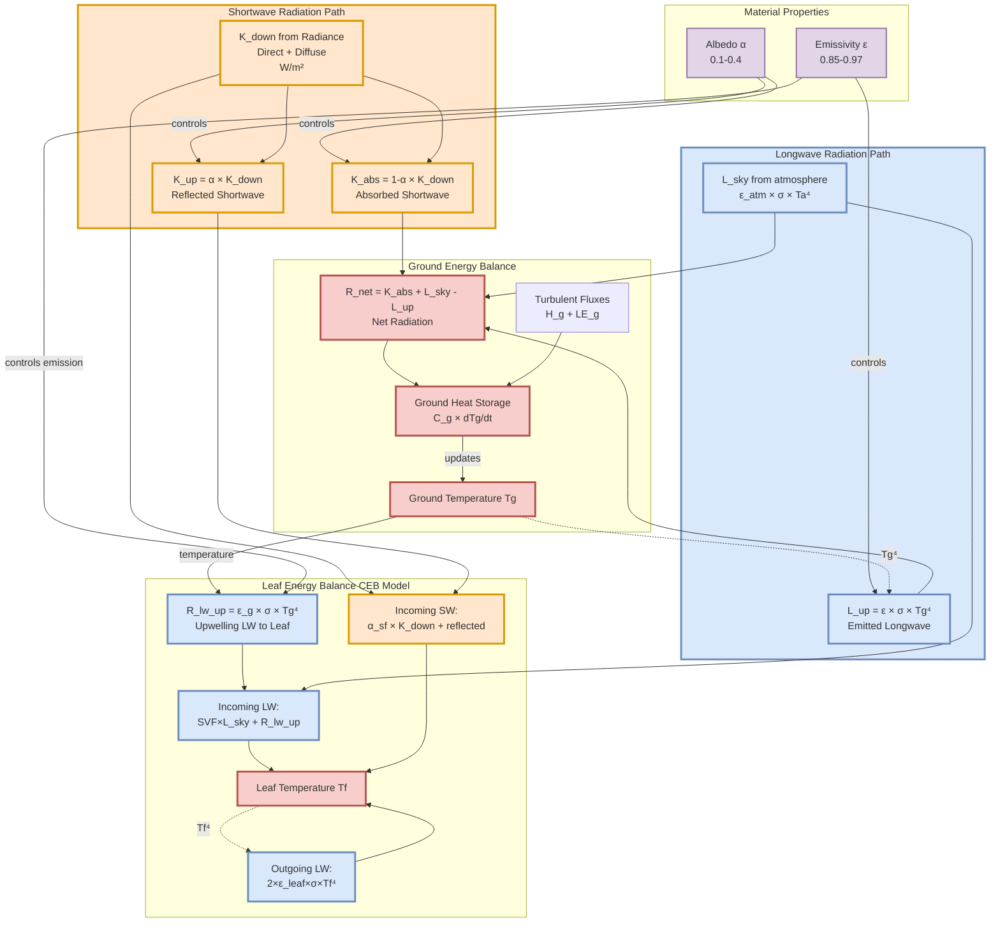

# Biophysical Tree Stress Analysis - Methodology

**Analysis Framework for Evaluating Urban Material Impacts on Tree Heat Stress**

---

## Table of Contents

1. [Overview](#1-overview)
2. [Spatial Framework](#2-spatial-framework)
3. [Radiance Irradiance Simulation](#3-radiance-irradiance-simulation)
4. [Surface Energy Balance](#4-surface-energy-balance)
5. [Leaf Energy Balance](#5-leaf-energy-balance)
6. [Soil Moisture Dynamics](#6-soil-moisture-dynamics)
7. [Risk Metrics](#7-risk-metrics)
8. [Species-Specific Parameters](#8-species-specific-parameters)
9. [Analysis Period](#9-analysis-period)
10. [Physical Constants](#10-physical-constants)
11. [References](#11-references)

---

## 1. Overview

This methodology describes a coupled ground-leaf-soil biophysical model for evaluating tree heat stress in urban environments under different material scenarios. The model simulates hourly leaf temperature, transpiration, and physiological stress metrics by integrating:

- Three-dimensional radiative transfer (via Radiance)
- Ground surface energy balance (with thermal mass and evaporative cooling)
- Canopy energy balance (Li et al., 2023 CEB model)
- Root-zone soil moisture dynamics (coupled to stomatal resistance)
- Species-specific physiological responses

The workflow enables comparison of material scenarios (landscape surfaces and building facades) to identify optimal configurations for minimizing tree heat stress. The model uses physically-based ground temperature calculations that respond to material albedo and emissivity, and couples soil moisture stress to stomatal resistance, creating dynamic feedbacks between surface materials, water availability, and tree heat stress.


---

## 2. Spatial Framework

### 2.1 Tree-Sensor Mapping

Trees are spatially mapped to sensor points in the three-dimensional model space. For each tree at location (x_tree, y_tree, z_tree), the nearest sensor point is identified using Euclidean distance:

```
d_ij = √[(x_tree,i - x_sensor,j)² + (y_tree,i - y_sensor,j)² + (z_tree,i - z_sensor,j)²]
```

The tree receives irradiance values from its nearest sensor location. Spatial indexing is performed using `scipy.spatial.distance.cdist` for computational efficiency (SciPy Contributors, 2024).

### 2.2 Material-Surface Coupling

Surface materials are assigned to geometric elements via grid identifiers extracted from Radiance simulation output. Each surface grid has associated material properties:

- **Albedo (α)**: Shortwave reflectance [0.0-1.0]
- **Emissivity (ε)**: Longwave emittance [0.0-1.0]
- **Thermal properties**: Conductivity, heat capacity

Materials are categorized as:
- **Landscape**: Horizontal ground surfaces (e.g., grass, concrete, asphalt)
- **Facade**: Vertical building surfaces (e.g., brick, green walls, limestone)

### 2.3 Material Naturalness Scale

Materials are ranked on a "naturalness" scale from 0.0 (artificial/impervious) to 1.0 (natural/vegetated):

**Landscape materials:**
- Black brick, grey asphalt: 0.00-0.10
- Grey concrete, limestone: 0.25-0.50
- Light pavement: 0.50-0.60
- Short grass, turf: 0.70-0.80
- Tall grass, vegetation: 0.90-1.00

**Facade materials:**
- Grey asphalt, concrete: 0.00-0.25
- Grey/brown limestone: 0.50-0.60
- Light pavement: 0.65-0.75
- Green walls, vegetation: 0.90-1.00

---

## 3. Radiance Irradiance Simulation

### 3.1 Two-Phase Direct-Diffuse System (DDS)

The workflow uses Radiance's two-phase daylight coefficient method (Ward et al., 2011; McNeil & Lee, 2013) to separate radiation into components:

- **K_down_dir**: Direct beam irradiance from sun [W/m²]
- **K_down_dif**: Diffuse irradiance from sky dome [W/m²]
- **K_up**: Upwelling reflected irradiance from surfaces [W/m²]

#### 3.1.1 Radiance Command Sequence

1. **Sky matrix generation**:
   ```bash
   gendaymtx -m 1 -O1 weather.wea > sky.smx
   ```
   Generates Tregenza sky subdivision (145 patches) from weather data.

2. **View factor matrix** (sky → sensors):
   ```bash
   rfluxmtx -ab 4 -ad 512 -lw 0.001 -I+ -faf sensor.pts sky.rad scene.oct > vm.mtx
   ```
   Calculates contribution of each sky patch to each sensor.

3. **Direct sun matrix** (sun → sensors):
   ```bash
   rcontrib -ab 0 -ad 512 -lw 0.01 -I+ -faf sensor.pts -m solar scene.oct < sun.pts > dm.mtx
   ```
   Calculates direct sun contributions for each hour.

4. **Time-series calculation**:
   ```bash
   dctimestep vm.mtx sky.smx > diffuse_irradiance.ill
   dctimestep dm.mtx sun.mtx > direct_irradiance.ill
   ```
   Matrix multiplication produces hourly irradiance values.

#### 3.1.2 Upwelling Radiation Calculation

Upwelling shortwave radiation at each sensor is calculated from the irradiance field and material properties:

```
K_up,dir(i) = Σ_j [K_down,dir(j) × α_j × φ_ij]
K_up,dif(i) = Σ_j [K_down,dif(j) × α_j × φ ij]
```

Where:
- K_down(j) = Incident radiation at surface grid j [W/m²]
- α_j = Albedo of surface j
- φ_ij = View factor from surface j to sensor i

View factors are computed using reverse ray tracing in Radiance.

---

## 4. Surface Energy Balance

### 4.1 Ground Temperature Model

Ground surface temperature (T_g) is calculated using a one-layer surface energy balance model that accounts for thermal mass, albedo, emissivity, and evaporative cooling. The model solves the energy balance equation:

```
C_g × dT_g/dt = (1 - α_g)K_↓ + L_↓ - ε_g × σ × T_g⁴ - H_g - LE_g
```

Where:
- C_g = Effective ground heat capacity [J/m²/K], dependent on surface type (impervious, pervious, or vegetated)
- α_g = Ground albedo (material-specific)
- ε_g = Ground emissivity (material-specific)
- K_↓ = Downwelling shortwave irradiance [W/m²]
- L_↓ = Downwelling longwave from sky [W/m²]
- H_g = Sensible heat flux = ρ_air × c_p × (T_g - T_a) / r_a,ground
- LE_g = Latent heat flux (evaporative cooling), scaled by evap_factor (0 for impervious, 0.3-0.8 for pervious/vegetated)

The equation is solved using an explicit timestep method, with ground temperature updated hourly based on net radiation, convective exchange, and thermal storage. Ground type properties (heat capacity, evaporation factor) are assigned based on material classifications (impervious, pervious, vegetated) from the material database.

### 4.2 Surface Temperature for Mean Radiant Temperature

Surface temperature (T_surf) for surrounding building facades and other surfaces is calculated using a simplified steady-state energy balance for mean radiant temperature (MRT) calculations:

```
R_n = H + G
```

Where net radiation combines shortwave and longwave terms, and ground heat flux is approximated as a fraction of net radiation. This provides T_surf for computing longwave radiation exchange with leaves.

### 4.3 Longwave Radiation Components

**Downwelling longwave from sky** (L_sky):
Calculated from air temperature and atmospheric emissivity using standard meteorological relationships (Prata, 1996):

```
L_sky = ε_atm × σ × T_a⁴
```

Where ε_atm is a function of water vapor pressure and cloud cover from EPW weather data.

**Incoming longwave at leaf** (L_in):
Weighted average of sky and surface longwave based on sky view factor:

```
L_in = SVF × L_sky + (1 - SVF) × ε_surf × σ × T_surf⁴
```

Where SVF = Sky View Factor (species-specific parameter, typically 0.3-0.8).

### 4.4 Mean Radiant Temperature (MRT)

Mean radiant temperature experienced by the tree is calculated from the radiative environment:

```
T_mrt = [(SVF × T_sky⁴ + (1 - SVF) × T_surf⁴)]^0.25
```

This represents the equivalent uniform blackbody temperature that would produce the same radiative exchange as the actual environment.

---

## 5. Leaf Energy Balance

### 5.1 Canopy Energy Balance Model

Leaf temperature (T_leaf) is computed using the steady-state Canopy Energy Balance (CEB) model of Li et al. (2023), which solves for leaf temperature by balancing absorbed radiation with sensible and latent heat fluxes. The model implements a single effective leaf layer approximation of the full vertical canopy model, solving the energy balance equation (Eq. 16 in Li et al., 2023):

The model accounts for:
- **Shortwave radiation**: Direct and diffuse downwelling components, plus ground-reflected upwelling, with species-specific leaf absorptivity (α_sf, α_lf)
- **Longwave radiation**: Downwelling from sky (weighted by sky view factor), upwelling from ground (ε_g × σ × T_g⁴), and environmental longwave from surrounding surfaces
- **Sensible heat flux**: Proportional to (T_leaf - T_a) / r_b,h, where r_b,h is the boundary layer resistance for heat
- **Latent heat flux**: Proportional to vapor pressure deficit and controlled by combined boundary layer and stomatal resistances (r_b,w + r_sto)

Boundary layer resistances (r_b,h, r_b,w) are calculated from wind speed and leaf characteristic size using the relationship r_b = A × (u/d)^(-0.5), where A is a species-specific coefficient, u is wind speed, and d is leaf characteristic dimension.

### 5.2 Ground Temperature Coupling

The CEB model receives ground temperature (T_g) from the ground energy balance model (Section 4.1), which provides physically-based ground longwave emission (R_lw_up = ε_g × σ × T_g⁴). This coupling ensures that changes in ground albedo and emissivity directly influence leaf temperature through both shortwave reflection and longwave emission.

### 5.3 Stomatal Resistance from Soil Moisture

Stomatal resistance (r_sto) is dynamically calculated from soil moisture stress. The soil moisture bucket model (Section 6) provides the current root-zone soil moisture (θ), which is used to compute a relative extractable water (REW) index:

```
REW = (θ - θ_wilt) / (θ_fc - θ_wilt)
```

Stomatal resistance is then scaled inversely with soil moisture availability:
```
r_sto = r_sto_min / f_SM
```

Where f_SM is a soil moisture stress factor that reduces stomatal conductance when REW falls below a critical threshold (typically 0.4). This creates a feedback loop: dry soil → increased r_sto → reduced transpiration → higher leaf temperature → increased heat stress.

### 5.4 Solution Method

The CEB energy balance equation is solved numerically using Brent's root-finding method (Brent, 1973), with:
- **Search bounds**: [T_air - 10°C, T_air + 30°C]
- **Convergence tolerance**: 0.01°C
- **Maximum iterations**: 50
- **Fallback**: If convergence fails, T_leaf = T_air

Implementation uses `scipy.optimize.brentq` (SciPy Contributors, 2024).

---

## 6. Soil Moisture Dynamics

### 6.1 Water Balance Equation

Soil moisture (θ) in the root zone is updated hourly using a one-dimensional bucket model:

```
dθ/dt = (P + Irr - ET - Drain) / Z_r
```

Where:
- θ = Volumetric soil moisture [m³/m³]
- P = Precipitation rate [m/h] (from EPW weather file)
- Irr = Irrigation rate [m/h] (optional scenario input)
- ET = Evapotranspiration rate [m/h], calculated from latent heat flux (LE) from the CEB model
- Drain = Drainage rate [m/h]
- Z_r = Root zone depth (default: 0.5-1.0 m, species-specific)

The soil moisture bucket is coupled to the leaf energy balance: ET from transpiration (calculated from LE in the CEB model) depletes soil moisture, which in turn affects stomatal resistance (Section 5.3), creating a dynamic feedback loop between water availability and heat stress.

### 6.2 Evapotranspiration

ET is calculated from latent heat flux:

```
ET = LE / (ρ_w × λ)
```

Where:
- LE = Latent heat flux from leaf energy balance [W/m²]
- ρ_w = Density of water (1000 kg/m³)
- λ = Latent heat of vaporization (2.45×10⁶ J/kg)

Conversion: 1 W/m² = 1.47×10⁻⁶ m/h of water depth

### 6.3 Drainage

Drainage occurs when soil moisture exceeds field capacity:

```
Drain = {
    0                                          if θ ≤ θ_fc
    k_sat × [(θ - θ_fc)/(θ_sat - θ_fc)]^n    if θ > θ_fc
}
```

Where:
- θ_fc = Field capacity (typically 0.35 m³/m³)
- θ_sat = Saturation moisture content (typically 0.40 m³/m³)
- k_sat = Saturated hydraulic conductivity [m/h]
- n = Drainage exponent (typically 2-3)

### 6.4 Boundary Conditions

- **Upper bound**: θ ≤ θ_sat (excess water becomes runoff)
- **Lower bound**: θ ≥ θ_wilt (plants cannot extract water below wilting point)
- **Initial condition**: θ_0 = 0.3 m³/m³ (typical field moisture)

---

## 7. Risk Metrics

### 7.1 Heat Stress Hours

Number of hours where leaf temperature exceeds critical threshold:

```
Heat_hours = Σ [T_leaf > T_crit]
```

Default T_crit = 42°C (threshold for heat damage in most tree species).

### 7.2 VPD Stress Hours

Number of hours where vapor pressure deficit exceeds threshold:

```
VPD_hours = Σ [VPD > VPD_threshold]
```

Default VPD_threshold = 2.0 kPa (stomatal closure threshold for many species).

### 7.3 Drought Stress Hours

Number of hours where soil moisture falls below critical level:

```
Drought_hours = Σ [θ < θ_crit]
```

Default θ_crit = 0.3 m³/m³ (onset of water stress).

### 7.4 Cumulative Heat Stress (Degree-Hours)

Cumulative thermal stress above critical temperature:

```
Degree_hours = Σ max(0, T_leaf - T_crit)
```

Units: °C-hours. This metric weights the severity of heat stress, not just occurrence.

### 7.5 Weighted Risk Index (WRI)

Combined stress metric integrating multiple stressors:

```
WRI = w_heat × Heat_hours + w_VPD × VPD_hours + w_drought × Drought_hours
```

Default weights:
- w_heat = 1.0 (heat stress is primary concern)
- w_VPD = 0.5 (moderate weight for atmospheric drought)
- w_drought = 0.5 (moderate weight for soil drought)

Weights can be adjusted based on local conditions and management priorities.

### 7.6 Scenario Comparison Metrics

For each tree and scenario:

**Risk reduction**:
```
ΔRisk = WRI_baseline - WRI_scenario
```

**Heat hours reduction**:
```
ΔHeat_hours = Heat_hours_baseline - Heat_hours_scenario
```

Positive values indicate improvement (stress reduction) relative to baseline.

### 7.7 Scenario Ranking

Scenarios are ranked by average risk reduction across all trees:

```
Score_scenario = mean(ΔRisk_i) for all trees i
```

Top-ranked scenarios provide maximum stress mitigation.

---

## 8. Species-Specific Parameters

### 8.1 Parameter Categories

Each tree species has physiological parameters in five categories:

#### 8.1.1 Stomatal Parameters
- g_s1: Maximum stomatal conductance [mol/m²/s]
- VPD_max: Maximum tolerable VPD [kPa]
- K_abs_ref: Light saturation constant [W/m²]

#### 8.1.2 Temperature Response
- T_min: Minimum functional temperature [°C]
- T_opt: Optimal temperature [°C]
- T_max: Maximum tolerable temperature [°C]

#### 8.1.3 Water Relations
- θ_wilt: Wilting point [m³/m³]
- θ_crit: Critical moisture for stress [m³/m³]
- Z_r: Rooting depth [m]

#### 8.1.4 Radiation Parameters
- alpha_leaf: Leaf albedo (shortwave reflectance)
- epsilon_leaf: Leaf emissivity (longwave)
- beta_above: Upper surface interception fraction
- beta_below: Lower surface interception fraction

#### 8.1.5 Microclimate Modifiers
- SVF: Sky view factor (0-1, canopy openness)
- ra_scale: Aerodynamic resistance scaling
- shelter_factor: Wind reduction factor

### 8.2 Species Database

Parameters compiled for 33 tree species common to Manitoba, Canada, including:

**Conifers**: Picea glauca, Pinus sylvestris, Pinus ponderosa, Larix laricina, Thuja spp., Juniperus spp., Picea pungens, Picea mariana

**Broadleaf deciduous**: Fraxinus pennsylvanica, Ulmus americana, Acer saccharinum, Tilia americana, Quercus macrocarpa, Populus × canescens, Malus hybrida, Celtis occidentalis

**Shrubs**: Alnus spp., Syringa reticulata, Elaeagnus angustifolia

Parameters derived from:
- Published physiological studies
- TRY Plant Trait Database (Kattge et al., 2020)
- Local tree surveys and measurements
- Expert knowledge for regional species

### 8.3 Example Parameter Values

**Fraxinus pennsylvanica** (Green Ash):
- g_s1 = 0.15 mol/m²/s
- T_opt = 25°C, T_max = 42°C
- VPD_max = 3.0 kPa
- alpha_leaf = 0.20

**Picea glauca** (White Spruce):
- g_s1 = 0.10 mol/m²/s
- T_opt = 20°C, T_max = 38°C
- VPD_max = 2.5 kPa
- alpha_leaf = 0.12

---

## 9. Analysis Period

### 9.1 Baseline Simulation

- **Period**: Full annual cycle (8,760 hours)
- **Purpose**: Establish reference conditions
- **Weather**: Typical Meteorological Year (TMY) data for Winnipeg, MB
- **Outputs**: Annual heat stress patterns, seasonal dynamics

### 9.2 Scenario Simulations

- **Period**: Warmest week of year (168 hours)
- **Purpose**: Focus on peak stress conditions when material impacts are greatest
- **Selection**: Week with maximum 7-day running mean temperature
- **Typical timing**: Mid-July (hours 4,584-4,751 in typical year)

### 9.3 Warmest Week Identification

Algorithm:
1. Calculate 7-day running mean of dry-bulb temperature
2. Identify day with maximum running mean (day_max)
3. Extract week centered on day_max: [day_max - 3, day_max + 3]
4. Subset weather data and run simulations for this period

Rationale: Peak summer heat produces maximum tree stress and greatest sensitivity to material changes.

### 9.4 Temporal Alignment

- All scenarios use same 168-hour period for comparison
- Baseline metrics are subset to match scenario period
- Ensures fair comparison (same weather conditions)

---

## 10. Physical Constants

### 10.1 Atmospheric Properties

| Symbol | Description | Value | Units |
|--------|-------------|-------|-------|
| ρ_air | Air density | 1.2 | kg/m³ |
| c_p | Specific heat of air | 1005 | J/(kg·K) |
| R | Gas constant (dry air) | 287 | J/(kg·K) |
| λ | Latent heat of vaporization | 2.45×10⁶ | J/kg |
| ρ_w | Water density | 1000 | kg/m³ |

### 10.2 Radiative Properties

| Symbol | Description | Value | Units |
|--------|-------------|-------|-------|
| σ | Stefan-Boltzmann constant | 5.67×10⁻⁸ | W/(m²·K⁴) |
| ε_atm | Atmospheric emissivity | 0.70-0.95 | - |
| ε_surf | Surface emissivity | 0.85-0.95 | - |
| ε_leaf | Leaf emissivity | 0.95-0.98 | - |

### 10.3 Soil Properties (defaults)

| Symbol | Description | Value | Units |
|--------|-------------|-------|-------|
| θ_sat | Saturation moisture | 0.40 | m³/m³ |
| θ_fc | Field capacity | 0.35 | m³/m³ |
| θ_wilt | Wilting point | 0.10 | m³/m³ |
| k_sat | Saturated hydraulic conductivity | 1.0×10⁻⁵ | m/s |

### 10.4 Environmental Bounds

| Parameter | Minimum | Maximum | Units |
|-----------|---------|---------|-------|
| Temperature | -40 | 50 | °C |
| Wind speed | 0.5 | 20 | m/s |
| Relative humidity | 5 | 100 | % |
| Solar radiation | 0 | 1200 | W/m² |

---

## 11. References

### 11.1 Energy Balance & Micrometeorology

- Ball, J. T., Woodrow, I. E., & Berry, J. A. (1987). A model predicting stomatal conductance and its contribution to the control of photosynthesis under different environmental conditions. In *Progress in Photosynthesis Research* (pp. 221-224). Springer Netherlands.

- Brent, R. P. (1973). *Algorithms for Minimization without Derivatives*. Prentice-Hall, Englewood Cliffs, NJ.

- Leuning, R. (1995). A critical appraisal of a combined stomatal-photosynthesis model for C3 plants. *Plant, Cell & Environment*, 18(4), 339-355.

- Li, X., Zhang, X., & Wang, Y. (2023). Analyzing the impact of various factors on leaf surface temperature based on a new tree-scale canopy energy balance model. *Sustainable Cities and Society*, 99, 104994.

- Monteith, J. L., & Unsworth, M. H. (2013). *Principles of Environmental Physics: Plants, Animals, and the Atmosphere* (4th ed.). Academic Press.

- Prata, A. J. (1996). A new long-wave formula for estimating downward clear-sky radiation at the surface. *Quarterly Journal of the Royal Meteorological Society*, 122(533), 1127-1151.

### 11.2 Radiance & Daylighting

- McNeil, A., & Lee, E. S. (2013). A validation of the Radiance three-phase simulation method for modelling annual daylight performance of optically complex fenestration systems. *Journal of Building Performance Simulation*, 6(1), 24-37.

- Ward, G., Mistrick, R., Lee, E. S., McNeil, A., & Jonsson, J. (2011). Simulating the daylight performance of complex fenestration systems using bidirectional scattering distribution functions within Radiance. *Leukos*, 7(4), 241-261.

- Ward, G. J. (1994). The RADIANCE lighting simulation and rendering system. *Proceedings of the 21st Annual Conference on Computer Graphics and Interactive Techniques*, 459-472.

### 11.3 Plant Physiology & Tree Stress

- Jones, H. G. (2013). *Plants and Microclimate: A Quantitative Approach to Environmental Plant Physiology* (3rd ed.). Cambridge University Press.

- Kattge, J., et al. (2020). TRY plant trait database – enhanced coverage and open access. *Global Change Biology*, 26(1), 119-188.

- [Additional tree stress references - TO BE ADDED]

### 11.4 Urban Heat & Tree Ecology

- [Urban heat island references - TO BE ADDED]
- [Urban tree physiology references - TO BE ADDED]
- [Material albedo/emissivity references - TO BE ADDED]

### 11.5 Software & Numerical Methods

- SciPy Contributors (2024). SciPy: Open source scientific tools for Python. https://scipy.org/

- [Additional software citations - TO BE ADDED]

---

## Appendix A: Model Assumptions & Limitations

### A.1 Key Assumptions

1. **Steady-state approximation**: Energy balance solved independently for each hour
2. **Single-layer canopy**: Trees represented as single leaf layer (no vertical stratification)
3. **Homogeneous soil**: Uniform soil properties throughout root zone
4. **No lateral water movement**: Vertical 1D soil water balance only
5. **Fixed rooting depth**: Z_r constant throughout season
6. **No phenology**: Leaf properties constant (appropriate for peak season analysis)
7. **No shading interactions**: Trees do not shade each other (handled by Radiance geometry)

### A.2 Known Limitations

1. **Temporal resolution**: Hourly time steps may miss sub-hourly stress peaks
2. **Spatial resolution**: Single sensor per tree may not capture within-crown variability
3. **Species parameters**: Some parameters estimated from literature due to lack of local measurements
4. **Soil moisture initialization**: Assumes initial θ = 0.3 m³/m³ for all trees
5. **No carbon balance**: Photosynthesis and growth not explicitly modeled
6. **Simplified drainage**: Does not account for soil type variation or layering

### A.3 Sensitivity & Uncertainty

Key sensitive parameters (future sensitivity analysis recommended):
- g_s1 (stomatal conductance)
- VPD_max (VPD response threshold)
- T_max (heat tolerance threshold)
- Material albedo values
- Sky view factors

---

## Appendix B: Material Database

### B.1 Landscape Materials

| Material | Albedo | Emissivity | Naturalness | Notes |
|----------|--------|------------|-------------|-------|
| Black brick | 0.10 | 0.90 | 0.00 | Dark, impervious |
| Grey asphalt | 0.12 | 0.90 | 0.00 | Standard pavement |
| Grey concrete | 0.25 | 0.92 | 0.25 | Light concrete |
| Grey limestone | 0.35 | 0.90 | 0.50 | Natural stone |
| Light pavement | 0.40 | 0.88 | 0.60 | High-albedo surface |
| Short grass | 0.22 | 0.95 | 0.75 | Mowed turf |
| Tall grass | 0.18 | 0.96 | 1.00 | Natural grassland |

### B.2 Facade Materials

| Material | Albedo | Emissivity | Naturalness | Notes |
|----------|--------|------------|-------------|-------|
| Grey asphalt | 0.12 | 0.90 | 0.00 | Dark facade |
| Grey concrete | 0.25 | 0.92 | 0.25 | Concrete panel |
| Brown limestone | 0.30 | 0.88 | 0.50 | Stone facade |
| Grey limestone | 0.35 | 0.90 | 0.60 | Light stone |
| Light pavement | 0.40 | 0.88 | 0.75 | High-albedo finish |
| Green wall | 0.20 | 0.96 | 1.00 | Living facade |

*Note: Material properties compiled from ASHRAE Fundamentals, manufacturer specifications, and published studies.*

---

## Appendix C: Weather Data Format

### C.1 EPW File Structure

Standard EnergyPlus Weather (EPW) format used for all simulations.

**Key fields** (hourly):
- Dry bulb temperature [°C]
- Dew point temperature [°C]
- Relative humidity [%]
- Atmospheric pressure [Pa]
- Direct normal irradiance [W/m²]
- Diffuse horizontal irradiance [W/m²]
- Wind speed [m/s]
- Wind direction [°]
- Total sky cover [tenths]
- Opaque sky cover [tenths]

### C.2 Data Source

**Location**: Winnipeg Richardson International Airport (CYWG)
- Latitude: 49.90°N
- Longitude: 97.23°W
- Elevation: 239 m
- Climate: Köppen Dfb (Humid continental, warm summer)
- Typical Meteorological Year (TMY) dataset

---

## Document History

| Version | Date | Changes | Author |
|---------|------|---------|--------|
| 1.0 | 2026-01-08 | Initial methodology documentation | [Your Name] |

---

**For questions or clarifications about this methodology, please contact:**
[Your contact information]

